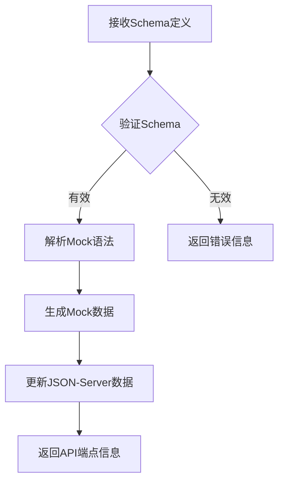
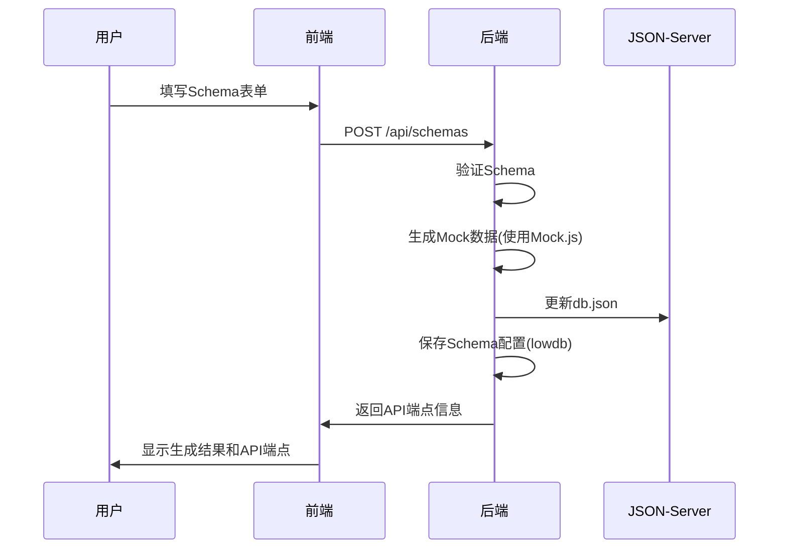

# Mock数据生成平台项目文档

## 1. 项目概述

### 1.1 项目目标
构建一个动态Mock数据生成平台，允许用户通过定义Mock语法生成模拟数据，并自动生成对应的RESTful API接口，满足前后端分离开发中的数据模拟需求。

### 1.2 核心功能
- 用户自定义数据结构（key + Mock语法）
- 指定生成数据条数（1-1000条）
- 动态生成RESTful API接口（GET/POST/PUT/DELETE）
- 数据预览与导出功能
- Schema配置持久化存储

## 2. 技术栈选型

### 2.1 前端技术栈
| 技术 | 版本 | 用途 |
|------|------|------|
| vue | 3.4.x | 核心框架 |
| Vite | 4.x | 构建工具 |
| Tailwind CSS | 3.x | 样式框架 |
| Monaco Editor | Latest | Mock语法高亮编辑 |
| Axios | 1.x | HTTP客户端 |

**选型理由**：
- vue提供组件化开发体验，适合表单密集型应用
- Vite构建速度快，开发体验佳
- Tailwind CSS实现快速UI开发
- Monaco Editor提供专业的代码编辑体验

### 2.2 后端技术栈
| 技术 | 版本 | 用途 |
|------|------|------|
| Node.js | 18.x | 运行环境 |
| Express | 4.x | Web框架 |
| JSON-Server | 1.x | 数据存储与基础API |
| Mock.js | 1.x | 动态数据生成 |
| lowdb | 3.x | Schema配置存储 |
| body-parser | 1.x | 请求体解析 |
| CORS | 2.x | 跨域处理 |

**选型理由**：
- Express提供灵活的中间件机制，便于扩展JSON-Server
- JSON-Server快速搭建REST API基础
- Mock.js语法丰富，支持复杂数据模拟
- lowdb轻量级，适合存储用户配置

## 3. 系统架构设计

### 3.1 整体架构图
```
+-----------------+     +-----------------+     +-----------------+
|   用户界面层     |     |   业务逻辑层     |     |   数据存储层     |
| (React前端应用)  |<--->| (Express服务)   |<--->| (JSON文件/lowdb)|
+-----------------+     +-----------------+     +-----------------+
        |                         |                         |
        v                         v                         v
+-----------------+     +-----------------+     +-----------------+
| 浏览器客户端     |     | 核心处理模块     |     | 持久化存储       |
| - Schema定义     |     | - Schema管理    |     | - db.json       |
| - 数据预览       |     | - Mock生成      |     | - schemas.json  |
| - API测试        |     | - 路由代理      |     |                 |
+-----------------+     +-----------------+     +-----------------+
```

### 3.2 服务架构详解

#### 3.2.1 前端架构
```
src/
├── components/       # 可复用UI组件
│   ├── SchemaEditor/ # Schema编辑器
│   ├── DataPreview/  # 数据预览组件
│   └── ApiEndpoint/  # API端点展示
├── pages/            # 页面级组件
│   ├── Dashboard/    # 主控制面板
│   └── SchemaList/   # Schema管理页
├── services/         # API服务
│   ├── api.js        # Axios实例
│   └── schemaService.js # Schema相关API
├── store/            # 状态管理
│   └── schemaStore.js # Schema状态
├── utils/            # 工具函数
│   └── mockParser.js # Mock语法解析
└── App.js            # 根组件
```

#### 3.2.2 后端架构
```
server/
├── config/           # 配置文件
│   └── db.json       # 主数据存储
├── controllers/      # 业务逻辑
│   ├── schemaController.js # Schema管理
│   └── dataController.js   # 数据生成
├── middleware/       # 中间件
│   ├── mockGenerator.js    # Mock数据生成
│   └── jsonServerProxy.js  # JSON-Server代理
├── models/           # 数据模型
│   └── Schema.js     # Schema数据模型
├── routes/           # 路由定义
│   ├── api.js        # 主API路由
│   └── json-server.js # JSON-Server路由
├── services/         # 服务层
│   ├── lowdbService.js # lowdb封装
│   └── mockService.js  # Mock服务
├── app.js            # 应用入口
└── server.js         # 服务启动
```

## 4. 核心模块设计

### 4.1 Schema管理模块

#### 数据结构
```json
{
  "id": "schema_123",
  "name": "用户数据",
  "resourceName": "users",
  "schema": {
    "id": "@guid",
    "name": "@name",
    "email": "@email",
    "age": "@int(18, 65)",
    "createdAt": "@date('yyyy-MM-dd')"
  },
  "count": 50,
  "createdAt": "2023-08-15T10:00:00Z",
  "updatedAt": "2023-08-15T10:00:00Z"
}
```

#### 接口设计
| 方法 | 路径 | 描述 |
|------|------|------|
| POST | /api/schemas | 创建新Schema |
| GET | /api/schemas | 获取所有Schema列表 |
| GET | /api/schemas/:id | 获取单个Schema详情 |
| PUT | /api/schemas/:id | 更新Schema |
| DELETE | /api/schemas/:id | 删除Schema |

### 4.2 Mock数据生成模块

#### Mock语法支持表
| 语法 | 示例 | 说明 |
|------|------|------|
| 基础类型 | `"@string"` | 随机字符串 |
| 数值类型 | `"@int(1,100)"` | 1-100随机整数 |
| 日期类型 | `"@date('yyyy-MM-dd')"` | 格式化日期 |
| 关联数据 | `"@pick(['选项1','选项2'])"` | 从数组中随机选择 |
| 嵌套结构 | `"address": { "city": "@city" }` | 嵌套对象生成 |

#### 生成流程


### 4.3 API代理模块

#### 路由代理机制
```javascript
// server/middleware/jsonServerUse.js
const jsonServer = require('json-server');
const router = jsonServer.router('config/db.json');

module.exports = (app) => {
  // 代理所有/api/*请求到JSON-Server
  app.use('/api', (req, res, next) => {
    // 动态更新db.json后重新加载router
    if (req.method === 'POST' && req.path === '/generate') {
      router.db.read();
    }
    next();
  });
  
  app.use('/api', router);
};
```

## 5. 详细实现方案

### 5.1 项目初始化

#### 创建项目目录结构
```bash
# 前端项目
npx create-vite@latest mock-generator-frontend --template react
cd mock-generator-frontend
npm install -D tailwindcss postcss autoprefixer
npx tailwindcss init -p

# 后端项目
mkdir mock-generator-backend
cd mock-generator-backend
npm init -y
npm install express json-server lowdb mockjs body-parser cors
```

#### 前端依赖安装
```bash
cd mock-generator-frontend
npm install axios @monaco-editor/react react-query
```

### 5.2 核心功能实现

#### 5.2.1 Mock数据生成服务 (后端)
```javascript
// server/services/mockService.js
const Mock = require('mockjs');

class MockService {
  generate(schema, count) {
    const template = {};
    
    // 转换schema为Mock.js模板
    Object.keys(schema).forEach(key => {
      const rule = schema[key];
      // 处理嵌套结构
      if (typeof rule === 'object' && !Array.isArray(rule)) {
        template[key] = this.generate(rule, 1)[0];
      } else {
        template[key] = rule;
      }
    });
    
    // 生成指定数量的数据
    return Mock.mock({
      'list|' + count: [template]
    }).list;
  }
}

module.exports = new MockService();
```

#### 5.2.2 Schema管理控制器 (后端)
```javascript
// server/controllers/schemaController.js
const low = require('lowdb');
const FileSync = require('lowdb/adapters/FileSync');
const adapter = new FileSync('config/schemas.json');
const db = low(adapter);
const mockService = require('../services/mockService');
const jsonServer = require('json-server');
const router = jsonServer.router('config/db.json');

// 初始化数据库
db.defaults({ schemas: [] }).write();

exports.create = (req, res) => {
  const { name, resourceName, schema, count } = req.body;
  
  // 生成Mock数据
  const mockData = mockService.generate(schema, count);
  
  // 更新主数据库
  const currentDb = router.db.getState();
  currentDb[resourceName] = mockData;
  router.db.setState(currentDb);
  router.db.write();
  
  // 保存Schema配置
  const newSchema = {
    id: `schema_${Date.now()}`,
    name,
    resourceName,
    schema,
    count,
    createdAt: new Date().toISOString(),
    updatedAt: new Date().toISOString()
  };
  
  db.get('schemas')
    .push(newSchema)
    .write();
  
  res.status(201).json({
    ...newSchema,
    endpoint: `/api/${resourceName}`
  });
};
```

#### 5.2.3 Schema编辑器 (前端)
```jsx
// src/components/SchemaEditor/index.jsx
import { useState } from 'react';
import Editor from '@monaco-editor/react';

const SchemaEditor = ({ value, onChange }) => {
  const [schema, setSchema] = useState(value || {});

  const handleEditorChange = (value) => {
    try {
      const parsed = JSON.parse(value);
      setSchema(parsed);
      onChange(parsed);
    } catch (e) {
      // 语法错误处理
    }
  };

  return (
    <div className="border rounded-md overflow-hidden">
      <div className="bg-gray-100 px-4 py-2 text-sm font-medium text-gray-700">
        Schema定义
      </div>
      <Editor
        height="300px"
        defaultLanguage="json"
        defaultValue={JSON.stringify(value || {}, null, 2)}
        onChange={handleEditorChange}
        options={{
          minimap: { enabled: false },
          fontSize: 14,
          formatOnType: true,
          formatOnPaste: true
        }}
      />
      <div className="p-3 bg-gray-50 text-xs text-gray-500">
        支持Mock.js语法，例如: "name": "@name", "age": "@int(18,65)"
      </div>
    </div>
  );
};

export default SchemaEditor;
```

### 5.3 数据流设计

#### 用户创建Schema流程


## 6. 部署方案

### 6.1 开发环境配置

#### 启动前端
```bash
cd mock-generator-frontend
npm install
npm run dev
```

#### 启动后端
```bash
cd mock-generator-backend
# 确保配置目录存在
mkdir -p config
echo '{"schemas":[]}' > config/schemas.json
echo '{}' > config/db.json

npm install
node server.js
```

### 6.2 生产环境部署

#### Docker部署方案
```Dockerfile
# 前端Dockerfile
FROM node:18-alpine as build
WORKDIR /app
COPY package*.json ./
RUN npm install
COPY . .
RUN npm run build

# 生产镜像
FROM nginx:alpine
COPY --from=build /app/dist /usr/share/nginx/html
COPY nginx.conf /etc/nginx/conf.d/default.conf
EXPOSE 80
CMD ["nginx", "-g", "daemon off;"]
```

```Dockerfile
# 后端Dockerfile
FROM node:18-alpine
WORKDIR /app
COPY package*.json ./
RUN npm install --production
COPY . .
EXPOSE 3000
CMD ["node", "server.js"]
```

#### Docker Compose配置
```yaml
version: '3'
services:
  frontend:
    build: ./mock-generator-frontend
    ports:
      - "80:80"
    depends_on:
      - backend
      
  backend:
    build: ./mock-generator-backend
    ports:
      - "3000:3000"
    volumes:
      - ./data:/app/config
```

## 7. 项目目录结构

### 完整项目结构
```
mock-generator/
├── docker-compose.yml
├── data/                   # 持久化数据存储
│   ├── db.json             # 主数据存储
│   └── schemas.json        # Schema配置存储
├── mock-generator-frontend/
│   ├── index.html
│   ├── package.json
│   ├── vite.config.js
│   └── src/
│       ├── App.jsx
│       ├── main.jsx
│       ├── components/
│       ├── pages/
│       └── services/
└── mock-generator-backend/
    ├── package.json
    ├── server.js
    ├── app.js
    ├── config/
    │   ├── db.json
    │   └── schemas.json
    ├── controllers/
    ├── middleware/
    ├── models/
    └── services/
```

## 8. 扩展与优化方向

### 8.1 近期优化
- [x] 添加用户认证系统（JWT）
- [x] 实现Schema版本控制
- [x] 增加响应延迟模拟功能
- [x] 添加错误状态码配置

### 8.2 中长期规划
- [x] 团队协作功能（多用户共享）
- [x] OpenAPI/Swagger文档生成
- [x] 数据导出为多种格式（CSV, Excel）
- [x] 自定义Mock函数扩展


**版本**: 1.0  
**最后更新**: 2023-08-15  
**维护团队**: Mock数据平台开发组
